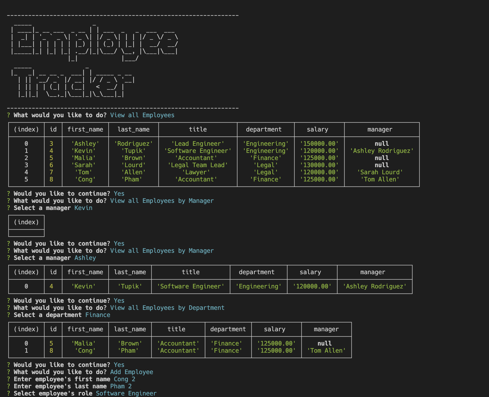

# Homework 12: Employee Tracker

## Table of Contents:

1. [Description](#description)
2. [Links](#links)
3. [User Story](#user-story)
4. [Requirement](#requirement)
5. [Preview](#preview)

## Description

Command line tool to manage employees using MySQL and Inquirer

## Links

- The repo of the tool: [Source Code](https://github.com/christopher211/employee-tracker)

- Here is the link of demo video: [Google drive](https://drive.google.com/file/d/1BMDYjYdCqJyoCxjfX19o7CFybPuvxvs9/view?usp=share_link)

## User Story

```md
AS A business owner
I WANT to be able to view and manage the departments, roles, and employees in my company
SO THAT I can organize and plan my business
```

## Acceptance Criteria

```md
GIVEN a command-line application that accepts user input
WHEN I start the application
THEN I am presented with the following options: view all departments, view all roles, view all employees, add a department, add a role, add an employee, and update an employee role
WHEN I choose to view all departments
THEN I am presented with a formatted table showing department names and department ids
WHEN I choose to view all roles
THEN I am presented with the job title, role id, the department that role belongs to, and the salary for that role
WHEN I choose to view all employees
THEN I am presented with a formatted table showing employee data, including employee ids, first names, last names, job titles, departments, salaries, and managers that the employees report to
WHEN I choose to add a department
THEN I am prompted to enter the name of the department and that department is added to the database
WHEN I choose to add a role
THEN I am prompted to enter the name, salary, and department for the role and that role is added to the database
WHEN I choose to add an employee
THEN I am prompted to enter the employee’s first name, last name, role, and manager, and that employee is added to the database
WHEN I choose to update an employee role
THEN I am prompted to select an employee to update and their new role and this information is updated in the database
```

## Preview


